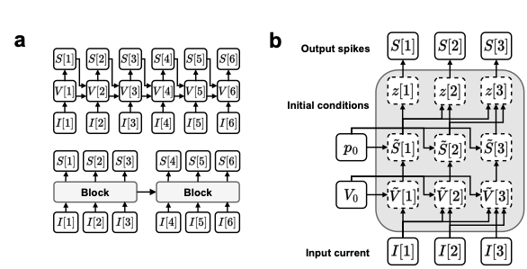
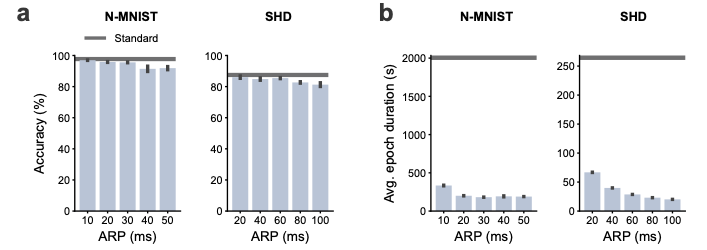
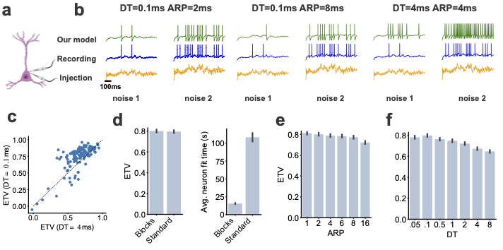

# Addressing the speed-accuracy simulation trade-off for adaptive spiking neurons

A new model for quickly training and simulating adaptive leaky integrate-and-fire spiking neural networks.

<p align="center">

</p>

## Installing dependencies

Install all required dependencies and activate the blocks environment using conda.
```
conda env create -f environment.yml
conda activate blocks
```

## Getting started tutorial

See the [notebooks/getting_started.ipynb](../notebooks/getting_started.ipynb) notebook for getting started with our model.

## Reproducing paper results

All the paper results can be reproduced using the scripts available in the `scripts` folder.

### Running benchmark experiments

The `python run_benchmarks.py` script will benchmark the time of the forward and backward passes of the blocks and the standard SNN model for different numbers of neurons and simulation steps.

### Training models

Ensure that the computer has a CUDA capable GPU with CUDA 11.7 installed. 

#### 1. Downloading and processing datasets

#### Machine learning datasets:
The content of the Neuromorphic-MNIST dataset can be [downloaded](https://www.garrickorchard.com/datasets/n-mnist) and unzipped into the `data/N-MNIST` directory. Thereafter, the `python convert_nmnist2h5.py` script (adapted from Perez-Nieves et al., 2021) needs to be run which processes the raw dataset. The Spiking Heidelberg Digits (SHD) dataset can be [downloaded](https://compneuro.net/posts/2019-spiking-heidelberg-digits/) and unzipped into the `data/SHD` directory.

#### E-phys dataset:

Running the `scripts/ephys/build_data.py` script will download and process the necessary data from the Allen Institute.

#### 2. Train model

You can train the blocks and standard SNN on the different datasets using the train.py scripts in the `scripts/ephys` and `scripts/supervised` folders respectively. See respective folders for different experiment run scripts.

## Building result figures

Speedup plots can be built using: `notebooks/results/speed_benchmarks.ipynb`

Machine learning benchmark plots can be built using: `notebooks/results/supervised_benchmarks.ipynb`

Neural-fitting plots can be built using: `notebooks/results/ephys.ipynb`

### Machine learning benchmark results
<p align="center">

</p>

### Neural-fitting results
<p align="center">

</p>